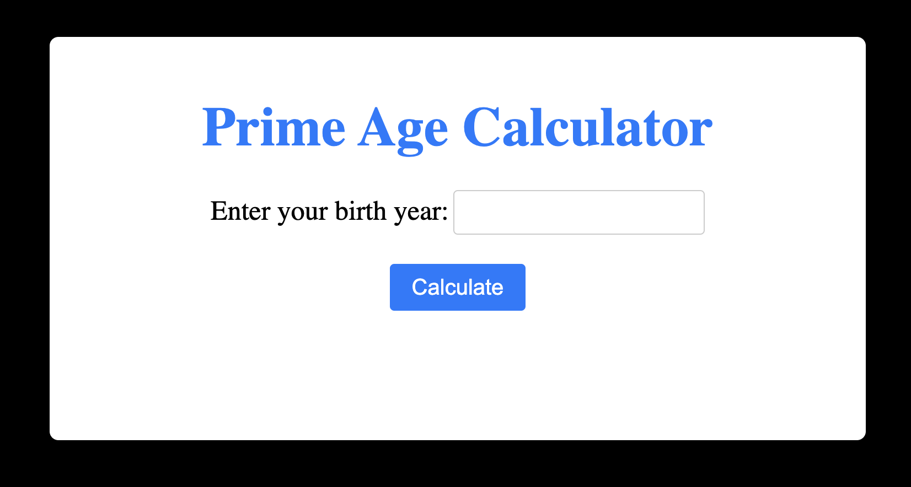
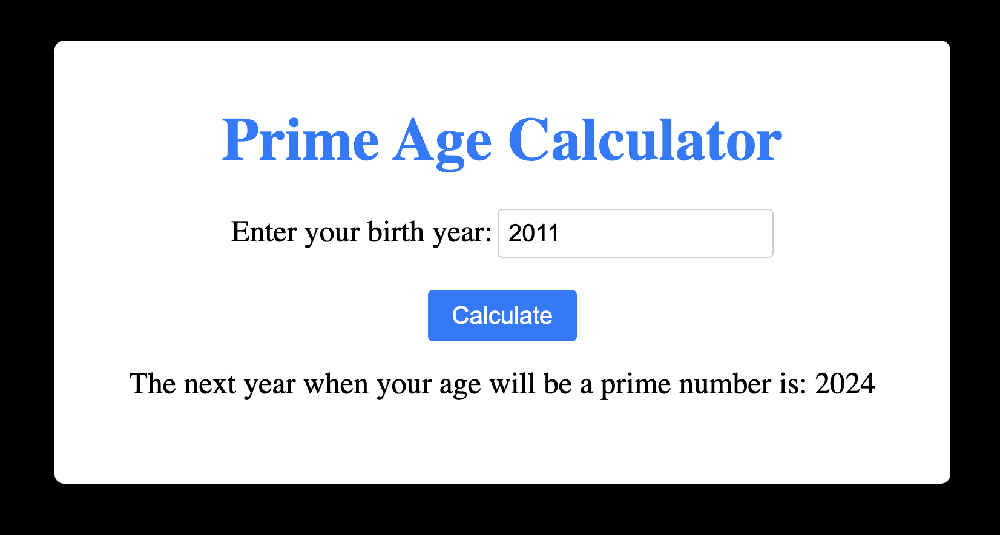

# Prime Age Calculator

The Prime Age Calculator is a web application built using Flask, a robust
Python web framework. This application enables users to calculate the next
prime year based on their birth year.

## Dependencies
1. Python3
2. Flask 2.0.1

## Prerequisites
1. Ensure you have Python 3 installed on your system. If not, download and
install Python.
2. Installation and Setup of the Application.
  - Clone the Repository:
  ```sh
  git clone https://github.com/Kunal2703/prime-age-calculator.git
  ```    
  - Navigate to the project directory: 
  ```sh
  cd prime-age-calculator
  ```
  - Install all the project's dependencies.
  ```sh
  pip3 install -r requirements.txt
  ```
  - Launch the Application:
  ```sh
  python3 app.py
  ```
  > The application will be accessible at http://127.0.0.1:5000 in the web
  browser.
   
## Project Structure

- `app.py`: The primary Python script that defines the Flask application,
handles routes, and performs the calculation of the next prime year.
- `templates/index.html`: A HTML template that provides the user interface for
the web application. It includes a form for entering the birth year and
displays the calculated result.
- `static/style.css`: A CSS file containing carefully crafted styles to enhance
the UI of the web application.

## How to Use

1. Enter your birth year in the provided input field.
2. Click the `Calculate` button to initiate the calculation process.
3. The application will compute the next prime year based on your birth year
and display the result below the form.



